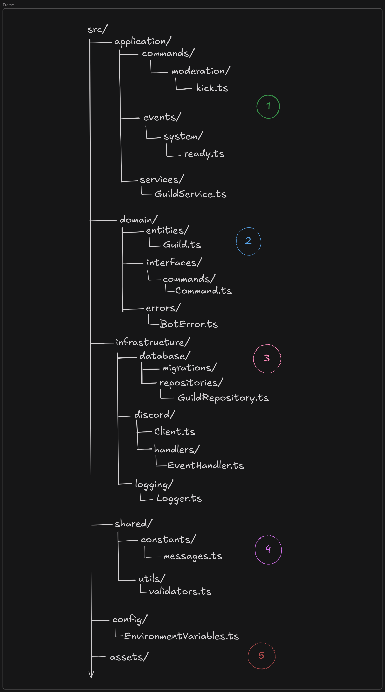

## Explicação detalhada da estrutura de pastas e arquivos do projeto

- [Explicação detalhada da estrutura de pastas e arquivos do projeto](#explicação-detalhada-da-estrutura-de-pastas-e-arquivos-do-projeto)
- [1 - Sobre a camada de `Application`](#1---sobre-a-camada-de-application)
  - [Exemplo da estrutura do comando:](#exemplo-da-estrutura-do-comando)
- [2- Sobre a camada de `Domain`](#2--sobre-a-camada-de-domain)



## 1 - Sobre a camada de `Application`
- A camada Application orquestra os casos de uso, conectando o domínio à infraestrutura. Ela utiliza serviços do domínio para executar processos específicos, sem implementar regras de negócio diretamente. Um exemplo simples: o comando `ping` do bot.

- Os itens principais dessa camada são os `commands` e `events`, que são os responsáveis pelos comandos no bot e suas respectivas respostas através dos eventos.

- É necessário seguir uma organização baseada na sua respectiva função e permissão. Por exemplo, os comandos de `admin` devem estar em uma pasta `moderation` ou semelhante.
- Todos seguem a mesma estrutura, o equivalente serve para os eventos.
### Exemplo da estrutura do comando:
- exemplo desatualizado
```js
import { Command } from "@structures/types/commands";
import { ApplicationCommandType } from "discord.js";

export default new Command({
  name: "ping",
  description: "Ping command",
  type: ApplicationCommandType.ChatInput,
  execute: async ({ interaction }) => {
    await interaction.reply("Pong!");
  },
});
```
- sendo assim, a maior diferença entre os comandos é a implementaçao do `execute`

## 2- Sobre a camada de `Domain`
- Contém as entidades principais e regras de negócio
- Define interfaces para repositórios e serviços
- Independente de frameworks externos
- É a camada responsável pela estrutura do projeto, aqui vai coisas como 
